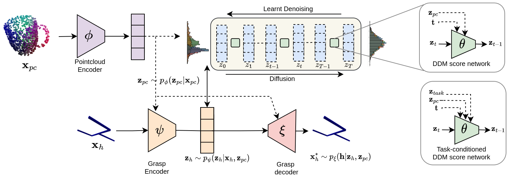

## <p align="center">GraspLDM: Generative 6-DoF Grasp Synthesis using Latent Diffusion Models<br> </p>

<div align="center">
  <a href="https://kuldeepbrd1.github.io" target="_blank">Kuldeep&nbsp;Barad</a> &emsp; <b>&middot;</b> &emsp;
  <a href="https://github.com/AndrejOrsula" target="_blank">Andrej&nbsp;Orsula</a> &emsp; <b>&middot;</b> &emsp;
  <a href="https://wwwen.uni.lu/layout/set/print/snt/people/antoine_richard" target="_blank">Antoine&nbsp;Richard</a> &emsp; <b>&middot;</b> &emsp;
  <a href="https://scholar.google.com/citations?user=qDJjBAIAAAAJ&hl=en" target="_blank">Jan&nbsp;Dentler</a> &emsp; <b>&middot;</b> &emsp;
  <a href="https://www.spacer.lu/" target="_blank">Miguel&nbsp;Olivares-Mendez</a> &emsp; <b>&middot;</b> &emsp;
  <a href="https://carolmartinez.github.io/" target="_blank">Carol&nbsp;Martinez</a> &emsp;
  <br>
<!--   <a href="https://arxiv.org/abs/xxx" target="_blank">Paper</a> &emsp; -->
<!--   <a href="https://x" target="_blank">Project&nbsp;Page</a>  -->
  <h3><a href="" target="_blank"> ArXiv</a> &nbsp; | &nbsp; <a href="https://kuldeepbrd1.github.io/grasp_ldm/" target="https://youtu.be/z3-otAp28XA">Video</a></h3>

<p align="center">
  
</p>
</div>

Vision-based grasping of unknown objects in unstructured environments is a key challenge for autonomous robotic manipulation. A practical grasp synthesis system is required to generate a diverse set of 6-DoF grasps from which a task-relevant grasp can be executed. Although generative models are suitable for learning such complex data distributions, existing models have limitations in grasp quality, long training times, and a lack of flexibility for task-specific generation. In this work, we present GraspLDM, a modular generative framework for 6-DoF grasp synthesis that uses diffusion models as priors in the latent space of a VAE. GraspLDM learns a generative model of object-centric SE(3) grasp poses conditioned on point clouds. GraspLDM's architecture enables us to train task-specific models efficiently by only re-training a small denoising network in the low-dimensional latent space, as opposed to existing models that need expensive re-training. Our framework provides robust and scalable models on both full and partial point clouds. GraspLDM models trained with simulation data transfer well to the real world without any further fine-tuning. Our models provide an 80% success rate for 80 grasp attempts of diverse test objects across two real-world robotic setups.

## Pre-requisites

1. Python >= 3.8
1. CUDA > 11.1 and compatible Nvidia driver
1. (Only for Docker) Nvidia container toolkit

## Setup

You can setup a python environment using **Conda** or **virtualenv**.
Alternatively, to avoid issues with system libraries, you can use a **Docker** container or a **VSCode** Devcontainer.

1. **Conda**

   ```
   conda create env -f environment.yml
   conda activate grasp_ldm
   ```

1. **virtualenv**

   ```
   python -m venv grasp_ldm
   source grasp_ldm/bin/activate
   pip install -r requirements.txt
   ```

1. **Docker**

   - Use the helper scripts to build a docker image and run the container.

   NOTE: Executing bash scripts may not always be safe. Double check before executing.

   ```
   cd .docker
   chmod +x build.sh run.sh

   # Build the image
   ./build.sh

   # Run a container
   ./run.sh
   ```

1. **Devcontainer**

   - Use the editor commands (`Ctrl+Shft+P`) and start typing `Dev Containers: Reopen in Container` and select.

   - Generally, use `Dev Containers: Reopen in Container` to start the devcontainer. When you wish to rebuild after change use  `Dev Containers: Rebuild and Reopen ion Container.`

   - For more info on Devcontainers, refer to : ...

## Prepare Data

1. Download the ACRONYM dataset using the instructions given in [`nvlabs/acronym`](https://github.com/NVlabs/acronym?tab=readme-ov-file#using-the-full-acronym-dataset).

1. Download the train/test splits data from the 🤗 HuggingFace [`kuldeepbarad/GraspLDM/splits`](https://huggingface.co/kuldeepbarad/GraspLDM/tree/main/splits)

## Run Generation Demo on ShapeNet Point Clouds

1. Download the pretrained models from 🤗 HuggingFace repository [`kuldeepbarad/GraspLDM`](https://huggingface.co/kuldeepbarad/GraspLDM).

1. Run the demo script using pretrained model:

   ```bash
   python tools/generate_grasps.py --exp_path <path-to-experiment-folder> --mode VAE --visualize

   # Example
   python tools/generate_grasps.py --exp_path checkpoints/generation/fpc_1a_latentc3_z4_pc64_simple_140k_noatt --mode VAE --visualize
   ```

   <details>
    <summary>All options</summary>

   - `--exp_path`: Path to the experiment checkpoint
     ```bash
     python generate_grasps.py --exp_path checkpoints/generation/fpc_1a_latentc3_z4_pc64_simple_140k_noatt
     ```
   - `--data_root`: Root directory for data (default: "data/ACRONYM")
   - `--mode`: Model type to use, either 'VAE' or 'LDM' (default: 'VAE')
   - `--split`: Data split to use (default: "test")
   - `--num_grasps`: Number of grasps to generate (default: 20)
   - `--visualize`: Enable visualization
   - `--no_ema`: Disable EMA model usage
   - `--num_samples`: Number of samples to generate (default: 11)
   - `--inference_steps`: Number of inference steps for LDM (default: 100)

   </details>

## Run Training on ACRONYM Dataset

Train grasp sampling models (VAE, DDM) with multi-GPU support.

NOTE: The training is done in two stages. First the VAE encoders are trained and then the latent space denoising diffusion model. 

```bash
# Basic usage
## 1. First train the VAE
python tools/train_generator.py --config configs/generation/fpc/fpc_1a_latentc3_z4_pc64_180k.py --model vae
## 2. Then train the DDM once VAE checkpoints are available.
python tools/train_generator.py --config configs/generation/fpc/fpc_1a_latentc3_z4_pc64_180k.py --model ddm
```

Optional usage examples:
```bash
# Multi-GPU training
python tools/train_generator.py --config configs/generation/fpc/fpc_1a_latentc3_z4_pc64_180k.py --model vae --num-gpus 4 --batch-size 32

# DDM training - NOTE: DDM training can only be done once the VAE model for this experiment has been trained
python tools/train_generator.py --config configs/generation/fpc/fpc_1a_latentc3_z4_pc64_180k.py --model ddm --seed 42
```

<details>
<summary> All options </summary>

- `--config`, `-c`: Path to config file
- `--model`, `-m`: Model type (`classifier`, `vae`, `ddm`)
- `--root-dir`, `-d`: Data root directory
- `--num-gpus`, `-g`: Number of GPUs
- `--batch-size`, `-b`: Batch size per device
- `--deterministic`: Enable deterministic training
- `--seed`: Random seed
- `-debug`: Disable wandb logging

</details>

## Attribution

If you find this code useful, please cite our work:

```
@article{barad2023graspldm,
  title={GraspLDM: Generative 6-DoF Grasp Synthesis using Latent Diffusion Models},
  author={Barad, Kuldeep R and Orsula, Andrej and Richard, Antoine and Dentler, Jan and Olivares-Mendez, Miguel and Martinez, Carol},
  journal={arXiv preprint arXiv:2312.11243},
  year={2023}
}
```

## License

Apache 2.0 License. See [LICENSE](LICENSE) for more details.

## Acknowledgements/External Resources

- Acronym tools and helpers are adapted from [https://github.com/NVlabs/acronym](https://github.com/NVlabs/acronym)

- PVCNN implementation and CUDA kernel are taken from [https://github.com/mit-han-lab/pvcnn](https://github.com/mit-han-lab/pvcnn)

- [`grasp_vdm/utils/config.py`](grasp_vdm/utils/config.py) is adapted from [https://github.com/open-mmlab/mmcv](https://github.com/open-mmlab/mmcv)

- Resnet models for DDM implementation is adapted from [https://github.com/lucidrains/denoising-diffusion-pytorch](https://github.com/lucidrains/denoising-diffusion-pytorch) and [https://github.com/openai/improved-diffusion](https://github.com/openai/improved-diffusion/blob/main/improved_diffusion/unet.py). Elucidated Diffusion Model is adapted from [https://github.com/NVlabs/edm](https://github.com/NVlabs/edm).
